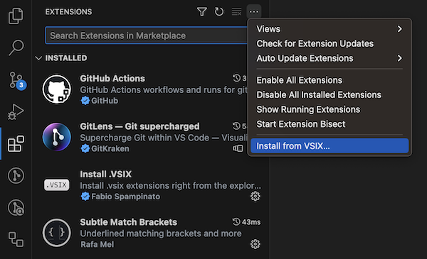
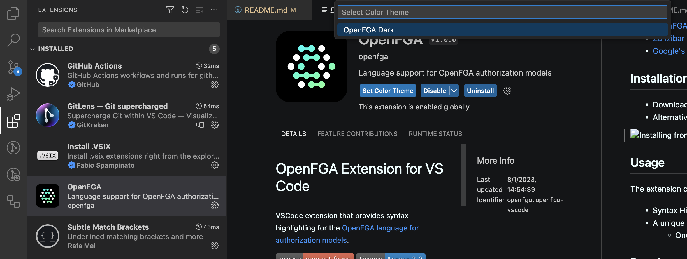
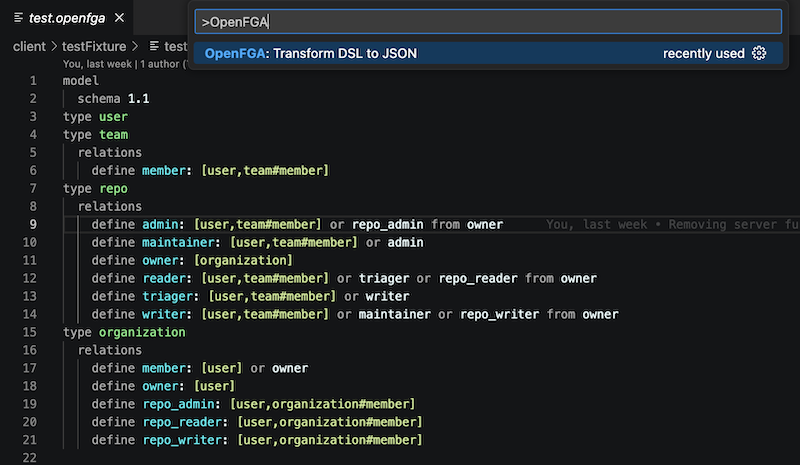
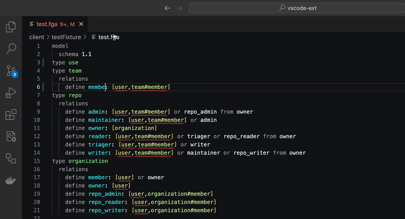

# OpenFGA Extension for VS Code

VS Code extension that provides syntax highlighting for the [OpenFGA](https://openfga.dev/) [language for authorization models](https://openfga.dev/docs/configuration-language).

[](https://marketplace.visualstudio.com/items?itemName=openfga.openfga-vscode)
[](https://open-vsx.org/extension/OpenFGA/openfga-vscode)
[](https://github.com/openfga/vscode-ext/releases)
[](https://securityscorecards.dev/viewer/?uri=github.com/openfga/vscode-ext)
[](https://openfga.dev/community)
[](https://twitter.com/openfga)

## About

[OpenFGA](https://openfga.dev) is an open source Fine-Grained Authorization solution inspired by [Google's Zanzibar paper](https://research.google/pubs/pub48190/). It was created by the FGA team at [Auth0](https://auth0.com) based on [Auth0 Fine-Grained Authorization (FGA)](https://fga.dev), available under [a permissive license (Apache-2)](https://github.com/openfga/rfcs/blob/main/LICENSE) and welcomes community contributions.

OpenFGA is designed to make it easy for application builders to model their permission layer, and to add and integrate fine-grained authorization into their applications. OpenFGA’s design is optimized for reliability and low latency at a high scale.

## Resources

- [OpenFGA Documentation](https://openfga.dev/docs)
- [OpenFGA API Documentation](https://openfga.dev/api/service)
- [OpenFGA on Twitter](https://twitter.com/openfga)
- [OpenFGA Community](https://openfga.dev/community)
- [Zanzibar Academy](https://zanzibar.academy)
- [Google's Zanzibar Paper (2019)](https://research.google/pubs/pub48190/)

## Installation

You can install the OpenFGA VS Code plugin from:

- [OpenFGA on the VS Code marketplace](https://marketplace.visualstudio.com/items?itemName=openfga.openfga-vscode)
- [OpenFGA on the OpenVSX Registry](https://open-vsx.org/extension/OpenFGA/openfga-vscode)
- [The VSIX releases on GitHub](https://github.com/openfga/vscode-ext/releases) for manual installation

  

## Usage

The extension currently offers 4 core features, with more to come.

- Syntax Highlighting for OpenFGA files
- A unique theme for OpenFGA for VS Code
  - Once installed, go to your extensions
  - Click on `OpenFGA` and click `Set Color Scheme`
  - Click on `OpenFGA Dark` in the prompt



- A command to transform `.fga` OpenFGA files to `JSON`
  - Open a `.fga` OpenFGA file in the editor
  - Open the `Command Pallette` using Ctrl+Shift+P (Windows) or Command+Shift+P (OSX)
  - Select `OpenFGA: Transform DSL to JSON`
  - A new tab will open with the transformed code



- Validation of OpenFGA's `.fga` files
  - As you type in a `.fga` OpenFGA file in the editor, the extension will highlight errors that make your models invalid



## Workflow to use it with the FGA CLI

The extension works great when combined with the [FGA CLI](https://github.com/openfga/cli) to iterate on your model and test it.

In order to do that:
1- Create a working directory to house the files for your store
2- Inside this directory, create a `model.fga` file with your model
3- Alongside the `model.fga`, create a `store.yaml` file with the following syntax

```yaml
---
name: Store Name # store name, optional
model_file: ./model.fga # a global model that would apply to all tests
tuples: # global tuples that would apply to all tests, optional
  - user: folder:1
    relation: parent
    object: folder:2
  - user: user:anne
    relation: editor
    object: folder:1
tests: # required
  - name: test-1
    description: testing that the model works # optional
    tuples: # tuples that only apply within the scope of this test
      - user: user:beth
        relation: viewer
        object: folder:2
    check: # a set of checks to run
      - user: user:anne
        object: folder:1
        assertions:
          # a set of expected results for each relation
          can_view: true
          can_write: true
          can_share: false
      - user: user:beth
        object: folder:2
        assertions:
          # a set of expected results for each relation
          can_view: true
          can_write: false
          can_share: false
    list_objects: # a set of list objects to run
      - user: user:anne
        type: folder
        assertions:
          # a set of expected results for each relation
          can_view:
            - folder:1
            - folder:2
          can_write:
            - folder:1
            - folder:2
          can_share: []
      - user: user:beth
        type: folder
        assertions:
          # a set of expected results for each relation
          can_view:
            - folder:2
          can_write: []
          can_share: []
```

When ready to test, from the terminal, and while inside your working directory, run:

```shell
fga model test --tests=./store.yaml
```

## Roadmap

A rough [roadmap](https://github.com/orgs/openfga/projects/1) for development priorities.

## Contributing

See the [DEVELOPMENT](./docs/DEVELOPMENT.md) and [CONTRIBUTING](https://github.com/openfga/.github/blob/main/CONTRIBUTING.md).

## Author

[OpenFGA](https://github.com/openfga)

## Acknowledgments

- CEL Textmate Grammar was taken from [vscode-cel](https://github.com/hmarr/vscode-cel)
- Range conversion from `yaml` to `vscode` from [actions/languageservices](https://github.com/actions/languageservices/blob/4280a967a8aa058dd3c8825349b90bc932d82283/workflow-parser/src/workflows/yaml-object-reader.ts#L220)

## License

This project is licensed under the Apache-2.0 license. See the [LICENSE](https://github.com/openfga/vscode-ext/blob/main/LICENSE) file for more info.
