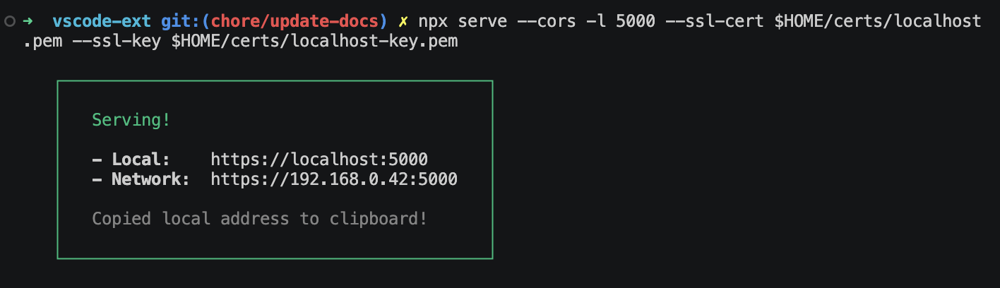
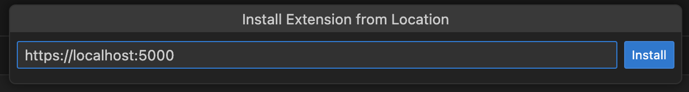
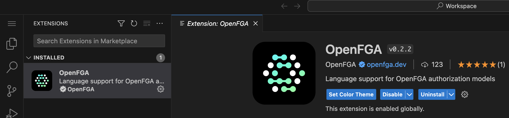

# Development and Contributing to the OpenFGA VS Code Extension

Read the [OpenFGA Contribution Process](https://github.com/openfga/.github/blob/main/CONTRIBUTING.md) and the [OpenFGA Code of Conduct](https://github.com/openfga/.github/blob/main/CODE_OF_CONDUCT.md).

## Getting Started

- Run `npm install` in the root directory. This installs all necessary npm modules.
- Run `npm run compile && npm run test-node` to execute the client node test suite.

## Distribution (Optional)

To generate an installable build of this extension, you can do the following:

- Run `npm install --global @vscode/vsce` to get the latest version of `vsce` for packaging
- Run `vsce package` to generate an installable `VISX` artifact for testing or distribution

## Structure

```
.
├── client // Language Client
│   ├── src
│   │   ├── test // End to End tests for Language Client / Server
│   │   ├── extension.node.ts // Language Client node entry point
│   │   └── extension.browser.ts // Language CLient web entry point
├── package.json // The extension manifest.
└── server // Language Server
    └── src
        ├── server.node.ts // Language Server node entry point
        ├── server.browser.ts // Language Server web entry point
        └── server.common.ts // Language Server common code
```

## Running the Client

- Run `npm install` in the root directory. This installs all necessary npm modules.
- Open the root directory in VS Code.
- Press Ctrl+Shift+B (Windows) or Command+Shift+B (OSX) to start compiling the client and server in [watch mode](https://code.visualstudio.com/docs/editor/tasks#:~:text=The%20first%20entry%20executes,the%20HelloWorld.js%20file.).
- Switch to the Run and Debug View in the Sidebar (Ctrl+Shift+D on Windows, Command+Shift+D on OSX).
- Select `Launch Client` from the drop down (if it is not already).
- Press ▷ to run the launch config (F5).

## Testing

- Run `npm install` in the root directory. This installs all necessary npm modules.
- Run `npm run compile` to compile the code & client for testing.
- Run `npm run test-node` to execute the client node test suite.

### Remote Testing the Web functionality

- To manually test the extension in the browser for [VS Code for the Web](https://vscode.dev/) before publishing, follow [these instructions](https://code.visualstudio.com/api/extension-guides/web-extensions#test-your-web-extension-in-vscode.dev) to setup a VS Code for the Web instance with your local extension, and then proceed with the normal testing flow.

#### Install Extension from location example steps

1. Use `mkcert` to generate a certificate for localhost
2. Use `serve` to startup a minimal web server
   
3. Open the command palette and choose:
   > Developer: Install Extension from location
4. Enter your serve url and select intstall
   
5. Extension will install, and be ready to test
   
